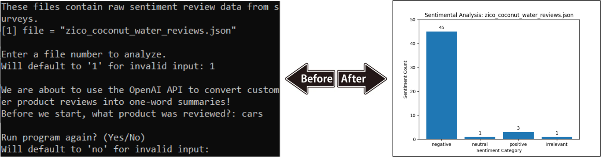

# Sentimental Analysis with OpenAI

...

## Live Demo

...

## Features

* **Backend:** ...
* **Data Science:** ...

## Prerequisites

Before running this project locally, ensure you have the following installed:

* IDE (VS Code, PyCharm, etc.)
* Install Python 3.10+ version > for type hinting compatability > visit [python download page](https://www.python.org/downloads/)
* Install OpenAI: `pip install openai` > see [API Key Setup](#api-key-setup)
* Install Matplotlib: `pip install matplotlib`
* Install NumPy: `pip install numpy`
* Bourne Shell compatible OS like Linux or macOS > to run test runner script that executes all unit tests in project > Windows users should [download WSL2](https://learn.microsoft.com/en-us/windows/wsl/install)

## Quick Start

Follow the steps below to correctly setup the project on your local device.

### API Key Setup

The purpose of these steps is to prevent publicly exposing your API on the internet.

1. Visit OpenAI page to [create API key](https://platform.openai.com/docs/libraries)
2. Terminal (safely save API Key): `echo 'export API_OPENAI="your_api_key_here"' >> ~/.bashrc && source ~/.bashrc`
3. Python file (imports): `import os`
4. Python file (access API Key): `api_key = os.getenv("API_OPENAI")`

## Usage

...

## Development Roadmap

Overall, this project resembled an ETL pipeline. The following resources were relevant for project completion:
* JSON: [Past file handling mini-project](https://github.com/barronbytes/Learning-to-Code/tree/main/File-Handling) on working with JSON data.
* Data Validation: [Past heart rate monitoring data processing mini-project](https://github.com/barronbytes/Learning-to-Code/tree/main/Data-Science/Summary-Statistics) completed to handle **data extraction**. Specifically, the `get_file_data.py` file within the source code folder.
* OpenAI API: [Official OpenAI API documentation for the Response API model](https://platform.openai.com/docs/guides/responses-vs-chat-completions) helped me [generate prompts](https://platform.openai.com/docs/guides/prompt-generation) for **data transformation**. Alternatively, the Reponse API model is a different way to interact with OpenAI that was not chosen.
* Matplotlib: [Official documentation on bar charts](https://matplotlib.org/stable/gallery/lines_bars_and_markers/bar_label_demo.html) helped me create and **load a visualization**.

## Results

...

## Analysis

### Question 1

> What is the **most common sentiment** observed in your sample of 50 reviews according to your OpenAI labeled data?

OpenAI sentimental analysis of 50 Zico Coconut Water reviews showed the most common sentiment was **negative**. Here are the results: 37 negative, 2 neutral, 11 positive, and 0 irrelevant. "Negative" consistently showed up as the most commmon sentiment, and "irrelevant" rarely showed up at all when the program was run multiple times.

### Question 2

> **How reliable** do you believe these labels are? Look at the respective labels OpenAI has generated for specific reviews, does it seem like the large language model accurately described the user's review? **What risk do model hallucinations introduce** into this analysis?

The sentiment labels produced by my program are unreliable due to hallucinations.
* **Reliability:** The model repeatedly gave different visualization results when provided the same input. Also, the program did not always produce output that matched the input length.
* **Hallucinations:** My program let users enter a client product for customer reviews. The results stayed mostly the same, even when the model was told the reviews were for a different or unrelated product. In the image below, the program analyzed 50 Zico Coconut Water reviews, but the user said they were about "cars." Still, the program marked 45 reviews as "negative" and only 1 as "irrelevant," even though the system context was set up to avoid this.

### Question 3

> Using the most common sentiment, what would you recommend to this Coconut Water producer to improve customer satisfaction? Should they continue to pursue current market/product outcomes, or does there exist an opportunity for this business to improve its product?

As stated previously, the sentiment analysis program had problems. I wouldn’t trust it to make business decisions. But if its results were reliable,I would tell the company to discontinue its product due to extremely low favorability. They likely have very few core customers. I would recommend the company take one of two actions: (1) rebrand and launch a new drink, or (2) stop making its own beverages and use its infrastructure to support more successful competitors as a supply chain manufacturer.

## Credits and Contributing

[The Knowledge House](https://www.theknowledgehouse.org/) provided the project requirements and raw data for this project. Contributions are welcome! Feel free to submit a pull request to improve the project or opena  issue to report any problems.