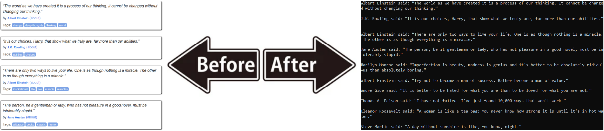

# Static Web Scraping

Web scraping refers to the process of getting select data from websites for a client. This mini-project allowed me to practice this on a static website, where content does not change. This allows for predictable outcomes that persist over time.

## Prerequisites

Before running this project locally, ensure you have the following installed:

* IDE (VS Code, PyCharm, etc.)
* Install Python 3.10+ version > for type hinting compatability
* Install BeautifulSoup (parsing interface): pip install beautifulsoup4
* Install lxml (parser): pip install lxml

This project used "lxml" as a parser for educational purposes. However, this is an optional step. You can instead use the built-in BeautifulSoup parser of "html.parser" if you prefer.

## Lesssons Learned

The site [toscrape.com](https://toscrape.com/) offers static content for web scraping practice. [I scraped a quotes page](https://quotes.toscrape.com/) using two alternative approaches with BeautifulSoup that yielded identical results: (1) the `find` method based on attribute-value pairs, and (2) the `select_one` method based on CSS selectors.

## Credits & Continuation

The following resources helped me get started:

* [BeautifulSoup (Documentation)](https://www.crummy.com/software/BeautifulSoup/bs4/doc/): Official developer documentation.
* [Keith Galli (YouTube)](https://www.youtube.com/watch?v=GjKQ6V_ViQE&t=4230s): Introduction guide to BeautifulSoup.

The following resources provide a deeper dive into web scraping for future use:

* [Keith Galli (YouTube)](https://www.youtube.com/watch?v=DcI_AZqfZVc&t=2087s): Advanced project demonstration.
* [Ted Boy (GitHub)](https://tedboy.github.io/bs4_doc/index.html): Unofficial documentation summary from a user.
