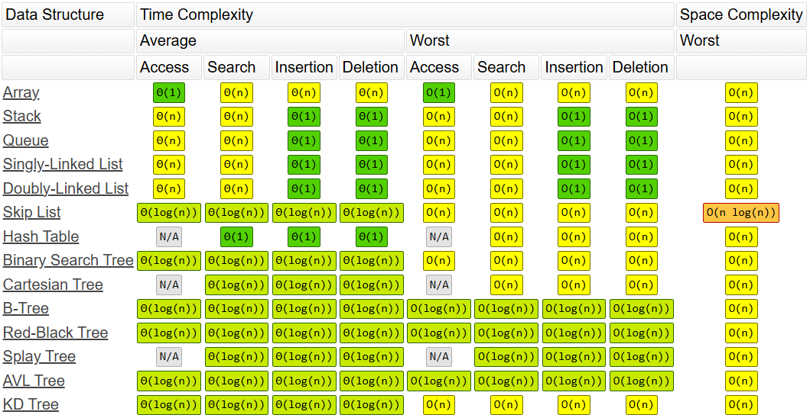

# Data Structures and Algorithms

Each folder in this repository showcases steps taken along my learning journey.

## Big O Notation

This notation is a metric used to measure the following:

* **Time Complexity:** How much time an algorithm takes to run
* **Space Complexity:** How much memory an algorithm takes to run

 *Big-O Complexity Chart from https://www.bigocheatsheet.com/*

 *Common Data Structure Operations from https://www.bigocheatsheet.com/*

 *Array Sorting Algorithms from https://www.bigocheatsheet.com/*