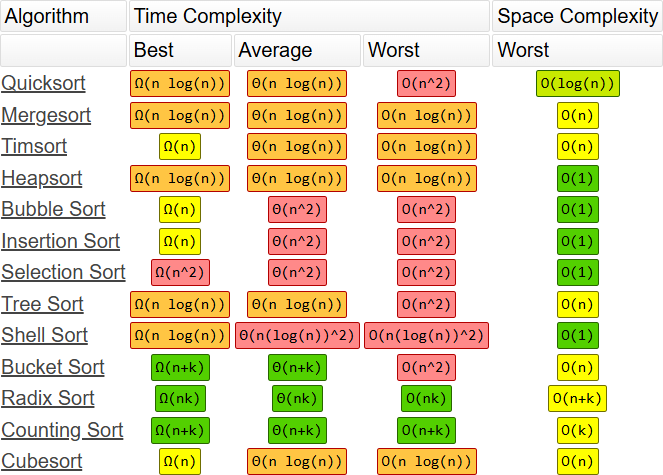

# Data Structures and Algorithms

Good code means good experiences for customers. We don't want lags or delays. Big O notation provides a standardized way to measure code efficiency. Learning this helps us understand how to scale codebases the right way.

## What are we measuring?

Algorithm performance can be measured in three ways:

* **Time Complexity:** How much **time** an algorithm takes to run
* **Space Complexity:** How much **memory** an algorithm takes to run
* **Network Complexity:** How much **data** an algorithm sends or receives across a network

## Big O Notation

Time complexity performance can be expressed using **Big O Notation**, which describes how an algorithm scales as input size increases. While it considers best-case, average-case, and worst-case scenarios, we only care about the worst-case run time in business. Below is a visual representation of common worst-case time complexities, ranked from most efficient to least efficient:

 *Big-O Complexity Chart from https://www.bigocheatsheet.com/*

 ## How to Analyze Time Complexities?

Here are some general rules and considerations to help determine time complexity:

## How to Analyze Time Complexities?

Here are some general rules and considerations to help you determine time complexity:

- **Ignore constants**: Constants don’t affect the growth rate. For example, `5n² + 6n + 4` simplifies to `O(n² + n + 1)`.
- **Drop lower-order terms**: As input size grows, the highest-order term dominates. For example, `O(n² + n + 1)` simplifies to `O(n²)`.
- **Combine variables only if they refer to the same input**: Don’t combine terms unless they represent the same input source. For example, `O(5m + 6n)` becomes `O(m + n)`, and `O(6m²n)` stays `O(m²n)`.

- **Loops**: A single loop over `n` elements results in `O(n)` time.

- **Nested loops**: A loop inside a loop over `n` elements leads to `O(n²)` or worse depending on depth.

- **Consecutive statements**: Add the complexities of each part. For example, `O(f(n)) + O(g(n))` becomes `O(f(n) + g(n))`.

- **Conditional statements (if/else)**: Use the path with the highest complexity. For example, `O(max(f(n), g(n)))`.

- **Recursive calls**: Use recurrence relations or recursion trees to analyze. For example, Merge Sort follows the recurrence `T(n) = 2T(n/2) + n` → `O(n log n)`.

 *Common Data Structure Operations from https://www.bigocheatsheet.com/*

 *Array Sorting Algorithms from https://www.bigocheatsheet.com/*