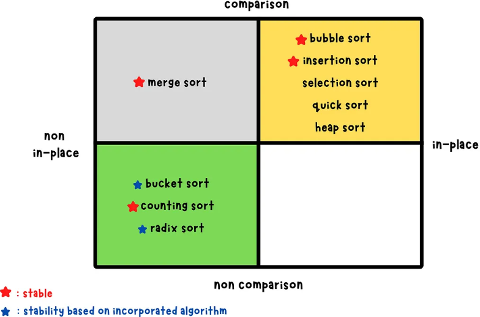
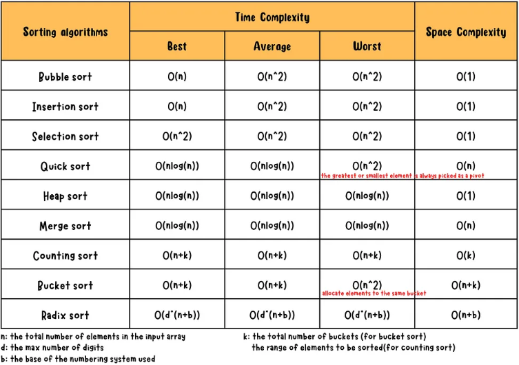

# [Array Sorting Algorithms](#array-sorting-algorithms)

Arrays can be used for sorting algorithms. Some of the most common ones are covered in this repository.

*Sorting Algorithms table by Claire Lee at [Medium](https://yuminlee2.medium.com/sorting-algorithms-summary-f17ea88a9174)*

*Time and Space Complexity table by Claire Lee at [Medium](https://yuminlee2.medium.com/sorting-algorithms-summary-f17ea88a9174)*

## Bubble Sort: O(n²) [🔝](#array-sorting-algorithms)

This is an **in-place** algorithm that sorts a list in place by repeatedly comparing and swapping adjacent elements. Each full pass through the list pushes the largest remaining unsorted element to its correct position at the end--this is the “bubble up” effect. After each pass, the range of comparisons shrinks by one since the end portion becomes sorted. The process continues until a full pass completes with no swaps, meaning the list is fully sorted.

Here's a breakdown of the time complexity:

* The `while` loop controls number of loop events (think **"addition"**)
* The `for` loop determines how much data processed (think **"terms"**)
* Together, this can be simplified to be **O(n²)**

## Insertion Sort: O(n²) [🔝](#array-sorting-algorithms)

This is an **in-place** algorithm that sorts a list by treating it as two parts: a sorted portion and an unsorted portion. At each step, the next value from the unsorted part is inserted into its correct position within the sorted part by swapping it leftward until it's in place. This process builds a fully sorted list from left to right.

Here's a breakdown of the time complexity:

* Best case: **O(n)** with pre-sorted data (i.e. good for small or nearly sorted lists)
* Worst case: **O(n²)** when reversing data (i.e. bad for large or descending lists)

## Merge Sort: O(n * log n) [🔝](#array-sorting-algorithms)

This is a **divide-and-conquer** algorithm that sorts an unsorted list by breaking a large problem into smaller, more manageable parts. The divide step is performed by the main function, `merge_sort`, which recursively splits the input list into halves until a base case is reached--sublists with one or zero elements. Once the base case is met, the helper function `merge` is used to sort and combine sublists in three key ways:

1. Sort two sublists of length one when the base case is fully met
2. Sort one sublist of one item and another sorted sublist of itmes as recursion unwinds
3. Sort two sublists of potentially multiple items as a final step to complete conquer step

Here's a breakdown of the time complexity:

* O(log n) comes from the recursive splitting performed by the `merge_sort` function
* O(n) comes from the merging of elements at each level, handled by the `merge` function
* Therefore, the overall time complexity is **O(n log n)**, combining both recursive depth and merge cost

## Quick Sort: O(n * log n) [🔝](#array-sorting-algorithms)

This is an **in-place divide-and-conquer** algorithm that sorts an unsorted list by partitioning values based upon a pivot value. The main function `quick_sort` narrows the sorting range by recursively placing the pivot in its final sorted position. The helper function `partition` rearranges values so that elements less than the pivot appear before it, and elements greater appear after.

These are the algorithm steps:

1. **Partitioning:** Select a pivot elment. Use pointer(s) to partition list around pivot value. Place pivot element into its corretly sorted position.
2. **Recursion:** Apply the same process to sublists formed on the left and right sides of the pivot element index. This follows the **divide-and-conquer** approach.
3. **Combining:** Happens **in-place** in algorithm.

Pivot element implementations:

* **Three-way partitioning:** Uses the **first** index as the pivot. Best suited for inputs with many duplicate values, as it groups `<`, `=`, and `>` in a single pass.
* **Hoare partition:** Uses the **first index** as the pivot. More efficient than Lomuto with duplicate values.
* **Lomuto partition:** Uses the **last index** as the pivot. Performs poorly when duplicates exist.
* **Randomized Quick Sort:** Uses a **random index** as the pivot. Reduces the chance of worst-case performance on sorted or patterned data.
* **Median-of-three pivot:** Uses the **median** of the first, middle, and last indices as the pivot. Produces more balanced partitions and avoids bad cases on nearly sorted input.

Here's a breakdown of the time complexity:

* Best case: **O(n log n)** when partitions are balanced (i.e. pivot consistently splits the list evenly)
* Worst case: **O(n²)** when partitions are unbalanced (i.e. pivot is always the smallest or largest element)

To avoid the worst case, randomize the input or choose a better pivot (e.g. median-of-three strategy)

## Credits & Contributing

Thank you [boot.dev](https://www.boot.dev/) for providing an online back-end learning platform with integrated project ideas. Contributions are welcome! Feel free to submit a pull request to improve this repository or open an issue to report any problems.
