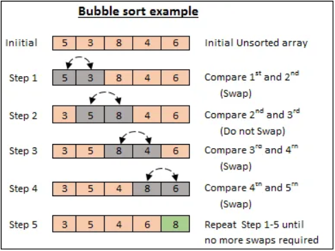
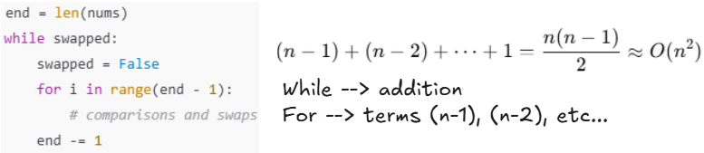

# Array Algorithms

Each algorithm listed below contains an accompanying file inside the `code` folder.

## Bubble Sort: O(n²)

This algorithm sorts a list in place by repeatedly comparing and swapping adjacent elements. Each full pass through the list pushes the largest remaining unsorted element to its correct position at the end--this is the “bubble up” effect. After each pass, the range of comparisons shrinks by one since the end portion becomes sorted. The process continues until a full pass completes with no swaps, meaning the list is fully sorted.

*Visual from https://tinyurl.com/yyv7px2c*

Here's a breakdown of the time complexity:

* The `while` loop controls number of loop events (think **"addition"**)
* The `for` loop determines how much data processed (think **"terms"**)
* Together, this can be simplified to be **O(n²)**

## Merge Sort: O(n * log n)

This algorithm uses a **divide-and-conquer** strategy to sort an unsorted list by breaking a large problem into smaller, more manageable parts. The divide step is performed by the main function, `merge_sort`, which recursively splits the input list into halves until a base case is reached--sublists with one or zero elements. Once the base case is met, the helper function `merge` is used to sort and combine sublists in three key ways:

1. Sort two sublists of length one when the base case is fully met
2. Sort one sublist of one item and another sorted sublist of itmes as recursion unwinds
3. Sort two sublists of potentially multiple items as a final step to complete conquer step

Here's a breakdown of the time complexity:

* O(log n) comes from the recursive splitting performed by the `merge_sort` function
* O(n) comes from the merging of elements at each level, handled by the `merge` function
* Therefore, the overall time complexity is **O(n log n)**, combining both recursive depth and merge cost
