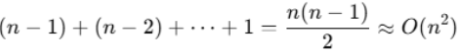

# Array Algorithms

Each algorithm listed below contains an accompanying file inside the `code` folder.

## Bubble Sort: O(n²)

This algorithm sorts an unsorted list. The image shows the underlying process:

*Visual from https://tinyurl.com/yyv7px2c*

Both a `while` and `for` loop contribute to the overall time complexity.

## Merge Sort: O(n * log n)

This algorithm uses a **divide-and-conquer** strategy to sort an unsorted list by breaking a large problem into smaller, more manageable parts. The divide step is performed by the main function, `merge_sort`, which recursively splits the input list into halves until a base case is reached--sublists with one or zero elements. Once the base case is met, the helper function `merge` is used to sort and combine sublists in three key ways:

1. Sort two sublists of length one when the base case is fully met
2. Sort one sublist of one item and another sorted sublist of itmes as recursion unwinds
3. Sort two sublists of potentially multiple items as a final step to complete conquer step
