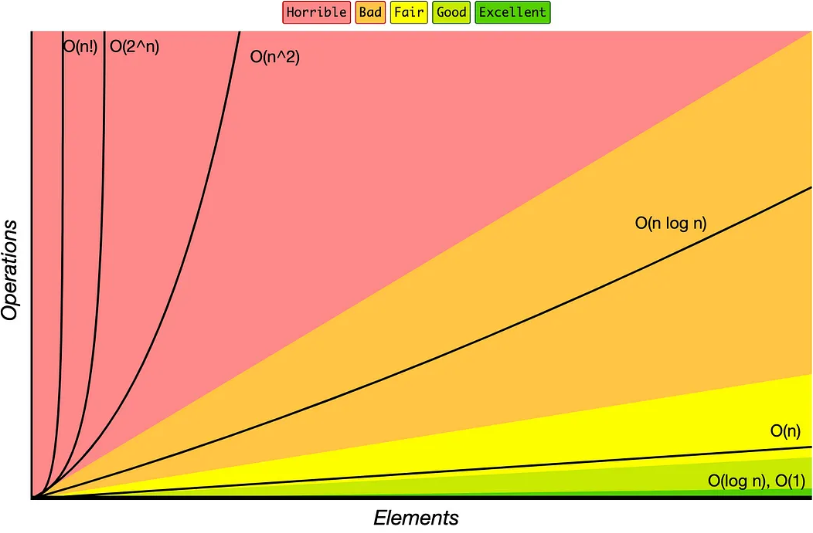
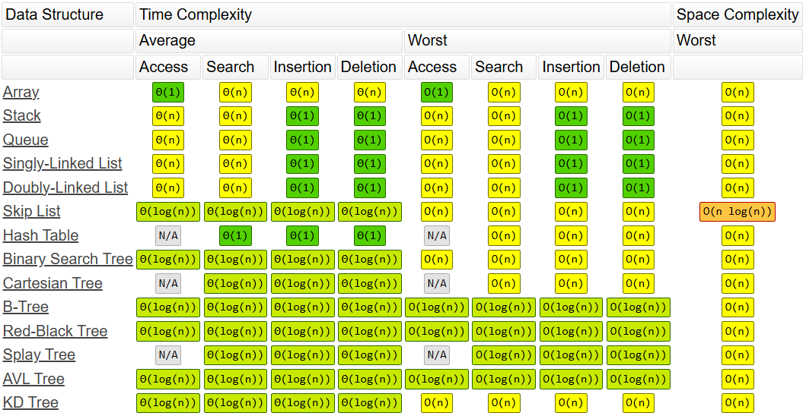
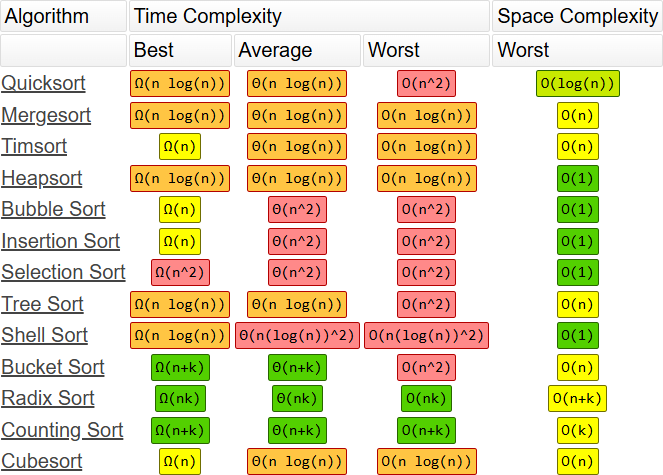

# Data Structures and Algorithms

Good code means good experiences for customers. We don't want lags or delays. Big O notation provides a standardized way to measure code efficiency. Learning this helps us understand how to scale codebases the right way.

## What are we measuring?

Algorithm performance can be measured in three ways:

* **Time Complexity:** How much **time** an algorithm takes to run
* **Space Complexity:** How much **memory** an algorithm takes to run
* **Network Complexity:** How much **data** an algorithm sends or receives across a network

## Big O Notation

Time complexity performance can be expressed using **Big O Notation**, which describes how an algorithm scales as input size increases. While it considers best-case, average-case, and worst-case scenarios, we only care about the worst-case run time in business. Below is a visual representation of common worst-case time complexities, ranked from most efficient to least efficient:

 *Big-O Complexity Chart from https://www.bigocheatsheet.com/*

Here’s the same information as a ranked list of Big O time complexities, from best (most efficient) to worst (least efficient):

1. O(1) — Constant time
2. O(log n) — Logarithmic time
3. O(n) — Linear time
4. O(n * log n) — Linearithmic time
5. O(n²) — Quadratic time
6. O(n³) — Cubic time
7. O(2ⁿ) — Exponential time
8. O(n!) — Factorial time

## How to Analyze Time Complexities?

Here are some general rules and considerations to help you determine time complexity:

- **Constant time operations**: assignment operations, arithmetic operations, logical operations, if statements, return statements, print statements... always `O(1)`
- **Ignore constants**: `5n² + 6n + 4` simplifies to `O(n² + n + 1)`
- **Highest-order term dominates**: `O(n² + n + 1)` simplifies to `O(n²)`
- **Same input sources CAN combine**: `O(5m + 6m)` becomes `O(m)`
- **Different input sources CANNOT combine**: `O(5m + 6n)` becomes `O(m + n)`
- **Nested loops of SAME data source**: outer loop `n` to inner loop `n` becomes `O(n²)`
- **Nested loops of DIFFERENT data source**: outer loop `n` to inner loop `m` becomes `O(n*m)`
- **Logarithmic time comes from halving**: repeatedly dividing input in half (e.g., binary search) becomes `O(log n)`
- **Factorial time comes from permutations**: generating all possible orderings (e.g., brute-force TSP or permutations) becomes `O(n!)`

## Tips to Write Better Code

Here are some tips to improve performance and reduce complexity:

- ❌ Avoid unnecessary nested loops — reduces complexity from `O(n²)` or worse to `O(n)`  
- ✅ Use hash maps or sets for fast lookups — improves from `O(n)` search to `O(1)` average case  
- ✅ Use the right data structure for the job (e.g., heap for priority tasks, queue for FIFO) — heaps allow `O(log n)` inserts and deletes; queues support `O(1)` operations  
- ❌ Don’t recompute things in loops — caching or memoization can reduce from `O(n²)` to `O(n)`  
- ✅ Use binary search or sorting tricks instead of brute-force scans — binary search reduces from `O(n)` to `O(log n)`  
- ❌ Avoid deep recursion unless tail-recursion or memoization is used — can reduce from `O(2ⁿ)` to `O(n)` with dynamic programming

## Common Big O Notation Algorithms

Big O Notation has been around long enough to solve many uses cases and algorithms shown below:

 *Common Data Structure Operations from https://www.bigocheatsheet.com/*

 *Array Sorting Algorithms from https://www.bigocheatsheet.com/*

## Diving Deeper with Projects

The following repos provide additional information:

* [big-o](https://github.com/barronbytes/learning-to-code/tree/main/data-structures-and-algorithms/big-o): Sample methods with different Big(O) time complexities
* [arrays](https://github.com/barronbytes/learning-to-code/tree/main/data-structures-and-algorithms/arrays): Different array sorting algorithms you can [read about here](https://github.com/barronbytes/learning-to-code/blob/main/data-structures-and-algorithms/algos-array-sorting.md)

## Credits & Contributing

Thank you [boot.dev](https://www.boot.dev/) for providing an online back-end learning platform with integrated project ideas. Contributions are welcome! Feel free to submit a pull request to improve this repository or open an issue to report any problems.
